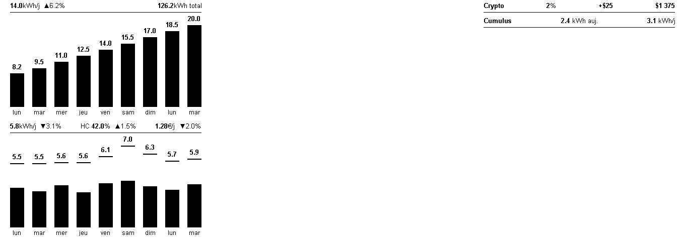

# Linky e-Paper Dashboard

Monitor your electricity consumption from a Linky smart meter on an e-paper display. The dashboard shows the last 9 days of consumption with off-peak/peak breakdown and key indicators to track your savings. Optionally, it also shows **daily solar production** from an EcoFlow PowerStream in the top half of the screen, and a **crypto-bot stats panel** in the top-right corner.



## Dashboard readings

### Bar chart

Each bar represents one day of electricity consumption. Bars are stacked:

- **Black fill** — peak hours (HP) consumption
- **Top line separator** — marks the boundary between off-peak and peak
- **White section above the line** — off-peak hours (HC) consumption
- **Value above the bar** — total kWh for that day
- **N/A** — incomplete data (less than 1 kWh recorded, typically a meter reporting gap)

### Stats banner

Three indicators are displayed above the chart. Each shows a **current value** and a **trend** compared to the previous 4 weeks.

| Indicator | Value | Trend calculation |
|-----------|-------|-------------------|
| **kWh/j** | Average daily consumption over the last 9 days | `(current_avg - prev_avg) / prev_avg × 100` — ▼ means you're consuming less |
| **HC %** | Ratio of off-peak consumption to total | `current_ratio - prev_ratio` (points) — ▲ means more off-peak usage (good) |
| **€/j** | Average daily cost (HP×price_hp + HC×price_hc + subscription/30.44) | Same % formula as kWh/j — ▼ means you're spending less |

- **▼ in black** = improving (less consumption or cost)
- **▲ in black** = improving (more off-peak ratio)
- **▼ in red** = degrading (less off-peak ratio)
- **▲ in red** = degrading (more consumption or cost)
- Days with less than 1 kWh are excluded from all calculations

### Solar production (optional, top chart)

When an EcoFlow PowerStream is configured, the top half shows daily solar production as full-black bars (last 9 completed days). The stats banner shows the **daily average** (`kWh/j`) with its trend (▲ in black = producing more, good) and the **period total** (`kWh total`). See the setup section below.

### Crypto-bot banner (optional, top-right)

When a crypto-bot GraphQL endpoint is configured, an inline title-style banner is drawn in the top-right space (same look as the chart titles): a `Crypto` label, then the **% return** (black when in profit, **red when negative**), `±$profit`, `$portfolio`, and a `SANDBOX` badge. Data is refreshed each time the ESP32 fetches the display. See the setup section below.

### Cumulus consumption (optional, top-right)

When a Zigbee2MQTT broker is configured, a second banner below the crypto one shows the water-heater's daily consumption: a `Cumulus` label, today's kWh and the recent daily average. The contactor reports only instantaneous power, so daily kWh are integrated over time (no historical backfill). See the setup section below.

## Hardware

| Component | Reference |
|-----------|-----------|
| e-Paper display | [Waveshare 10.85" (G) 4-color](https://www.waveshare.com/10.85inch-e-paper-hat-plus.htm) |
| Microcontroller | [Seeed XIAO ESP32-S3](https://www.seeedstudio.com/XIAO-ESP32S3-p-5627.html) |
| Server | Any Docker host (CasaOS, Raspberry Pi, NAS...) |
| 3D printed case | [Dashboard.3mf](Dashboard.3mf) — matte PLA recommended |

## Installation

### 1. Get a Linky token

1. Go to [conso.boris.sh](https://conso.boris.sh)
2. Log in with your Enedis account
3. Authorize data access
4. Copy the JWT token (valid for 3 years)

### 2. Configure environment variables

```bash
cp .env.example .env
```

Edit `.env` with your values:

```env
# Required — your Linky token
LINKY_TOKEN=eyJhbGci...your_token

# Your meter PRM (14 digits, visible on your meter or on Enedis)
LINKY_PRM=your_prm_here

# Off-peak hours windows (format: HH:MM-HH:MM, comma-separated)
# Check your electricity contract for your specific time slots
HC_WINDOWS=23:32-5:32,15:02-17:02

# Your contract pricing (€/kWh)
PRICE_HP=0.2065
PRICE_HC=0.1579
PRICE_ABO_MONTHLY=15.65

# Refresh interval in seconds (default: 1 hour)
REFRESH_INTERVAL=3600
```

#### Optional — EcoFlow PowerStream solar production

Add your EcoFlow account credentials to display daily solar production above the consumption chart. The server connects to EcoFlow's app MQTT broker, reads the inverter's reported PV power, and integrates it into daily kWh totals (the official Developer API only exposes instantaneous watts, with no historical counter). The chart shows the **last 9 completed days** — today is excluded (a partial day is not a reliable total), and days without data show as **N/A**. There is **no backfill**: the history starts at the first connection and fills in day by day.

```env
ECOFLOW_EMAIL=your_ecoflow_account_email
ECOFLOW_PASSWORD=your_ecoflow_account_password
ECOFLOW_DEVICE_SN=your_powerstream_serial_number
ECOFLOW_API_HOST=api-e.ecoflow.com   # EU; use api.ecoflow.com (global) or api-a.ecoflow.com (asia)
```

#### Optional — Crypto-bot stats panel

Point the dashboard at your crypto-bot's GraphQL endpoint to show its trading stats in the top-right corner. Because the dashboard container uses a bridge network, use the bot's **LAN IP** (not `localhost`) when both run on the same host. The panel is fetched whenever the ESP32 pulls the display and is omitted if the endpoint is unreachable.

```env
CRYPTO_API_URL=http://192.168.1.199:3003/graphql
CRYPTO_API_TOKEN=your_crypto_bot_api_token   # the bot's NITRO_API_TOKEN; omit if no auth
```

#### Optional — Cumulus (water-heater) consumption

Point the dashboard at your Zigbee2MQTT broker to show the water-heater's daily consumption. The `cumulus` device (a Legrand contactor) reports only instantaneous power, so the server subscribes to its MQTT topic and integrates that power into daily kWh — there is **no backfill**, the history starts at the first connection. Use the broker's **LAN IP** (bridge network). Credentials are optional if the broker allows anonymous connections.

```env
CUMULUS_MQTT_HOST=192.168.1.199
CUMULUS_MQTT_PORT=1883
CUMULUS_TOPIC=zigbee2mqtt/cumulus
CUMULUS_MQTT_USERNAME=                 # omit if the broker is anonymous
CUMULUS_MQTT_PASSWORD=
```

### 3. Run with Docker Compose

```bash
curl -O https://raw.githubusercontent.com/moifort/dashboard/main/docker-compose.yml
docker compose up -d
```

The dashboard will be available at `http://your-server:5000`.

### 4. Run on CasaOS

Import the CasaOS compose file from the CasaOS interface using this URL:

```
https://raw.githubusercontent.com/moifort/dashboard/main/docker-compose.casaos.yml
```

### 5. Flash the ESP32

Requires [Arduino CLI](https://arduino.github.io/arduino-cli/) with `esp32:esp32` core:

```bash
brew install arduino-cli
arduino-cli core install esp32:esp32
```

Compile and flash:

```bash
arduino-cli compile --fqbn "esp32:esp32:XIAO_ESP32S3:PSRAM=opi" esp32-display/
arduino-cli upload --fqbn "esp32:esp32:XIAO_ESP32S3:PSRAM=opi" --port /dev/cu.usbmodem101 esp32-display/
```

### 6. Configure the ESP32

On first boot, open the serial monitor:

```bash
arduino-cli monitor --port /dev/cu.usbmodem101 --config baudrate=115200
```

The ESP32 will prompt for:
- **WiFi SSID** and **password**
- **Server URL** (default: `http://192.168.1.199:5000`)

To reconfigure later, type `reset` within 3 seconds of boot.

### Refresh schedule

The ESP32 refreshes the display twice a day at **8:00** and **17:00** (CET/CEST). Time is synced via NTP on each wake cycle.

## Endpoints

| Method | Path | Description |
|--------|------|-------------|
| `GET` | `/display` | EPD binary buffer (163,200 bytes) — for the ESP32 |
| `GET` | `/` | HTML preview of the dashboard in a browser |
| `GET` | `/status` | Server status as JSON (last fetch, cache, config) |
| `POST` | `/refresh` | Force a data refresh |

## 3D Printed Case

The [Dashboard.3mf](Dashboard.3mf) file contains the printable case. Recommended settings:

- **Material**: matte PLA (cleaner look, no reflections)
- **Infill**: 15%
- **Supports**: none

## License

MIT
