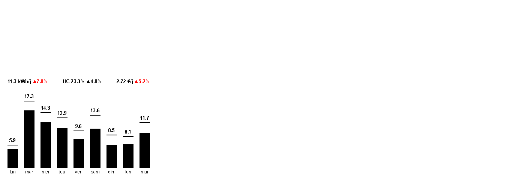

# Linky e-Paper Dashboard

Visualisez votre consommation electrique Linky sur un ecran e-paper. Le dashboard affiche les 9 derniers jours de consommation avec la repartition heures creuses / heures pleines, et des indicateurs pour suivre vos economies.



## Ce que ca fait

- **Consommation journaliere** — un graphique a barres empilees HC/HP pour chaque jour
- **Moyenne kWh/jour** — avec la progression par rapport aux 4 semaines precedentes
- **Part heures creuses** — pour verifier qu'on decale bien sa consommation en HC
- **Cout moyen par jour** — pour suivre les economies en euros
- **Progressions en rouge** — quand ca va dans le mauvais sens (on consomme plus, on depense plus)
- **Mise a jour automatique** — le serveur rafraichit les donnees toutes les heures

## Materiel

| Composant | Reference |
|-----------|-----------|
| Ecran e-paper | [Waveshare 10.85" (G) 4 couleurs](https://www.waveshare.com/10.85inch-e-paper-hat-plus.htm) |
| Microcontroleur | [Seeed XIAO ESP32-S3](https://www.seeedstudio.com/XIAO-ESP32S3-p-5627.html) |
| Serveur | N'importe quel serveur Docker (CasaOS, Raspberry Pi, NAS...) |
| Boitier 3D | [Dashboard.3mf](Dashboard.3mf) — PLA matte recommande |

## Installation

### 1. Obtenir un token Linky

1. Allez sur [conso.boris.sh](https://conso.boris.sh)
2. Connectez-vous avec votre compte Enedis
3. Autorisez l'acces a vos donnees
4. Copiez le token JWT (valide 3 ans)

### 2. Configurer les variables d'environnement

```bash
cp .env.example .env
```

Editez `.env` avec vos valeurs :

```env
# Obligatoire — votre token Linky
LINKY_TOKEN=eyJhbGci...votre_token

# Votre PRM (14 chiffres, visible sur votre compteur ou sur Enedis)
LINKY_PRM=REDACTED_PRM

# Horaires heures creuses (format HH:MM-HH:MM, separees par des virgules)
# Consultez votre contrat EDF pour connaitre vos plages
HC_WINDOWS=23:32-5:32,15:02-17:02

# Tarifs de votre contrat (€/kWh)
PRICE_HP=0.2065
PRICE_HC=0.1579
PRICE_ABO_MONTHLY=15.65

# Intervalle de rafraichissement en secondes (defaut: 1h)
REFRESH_INTERVAL=3600
```

### 3. Lancer avec Docker Compose

```bash
docker compose up -d
```

Le dashboard sera accessible sur `http://votre-serveur:5000`.

### 4. Lancer sur CasaOS

```bash
docker compose -f docker-compose.casaos.yml up -d
```

Ou importez `docker-compose.casaos.yml` depuis l'interface CasaOS.

### 5. Flasher l'ESP32

Flashez le firmware dans `../esp32-display/` sur votre XIAO ESP32-S3 avec PlatformIO. L'ESP32 doit etre sur le meme reseau WiFi que votre serveur.

### 6. Connecter l'ESP32 au serveur

L'ESP32 doit appeler `GET http://votre-serveur:5000/display` pour recuperer l'image a afficher. Le endpoint retourne directement le buffer binaire de 163 200 octets.

## Endpoints

| Methode | Path | Description |
|---------|------|-------------|
| `GET` | `/display` | Buffer EPD binaire (163 200 octets) — pour l'ESP32 |
| `GET` | `/` | Apercu HTML du dashboard dans un navigateur |
| `GET` | `/status` | Etat du serveur en JSON (dernier fetch, cache, config) |
| `POST` | `/refresh` | Forcer un rafraichissement des donnees |

## Boitier 3D

Le fichier [Dashboard.3mf](Dashboard.3mf) contient le boitier a imprimer. Parametres recommandes :

- **Materiau** : PLA matte (rendu plus elegant, pas de reflets)
- **Remplissage** : 15%
- **Supports** : non

## Licence

MIT
